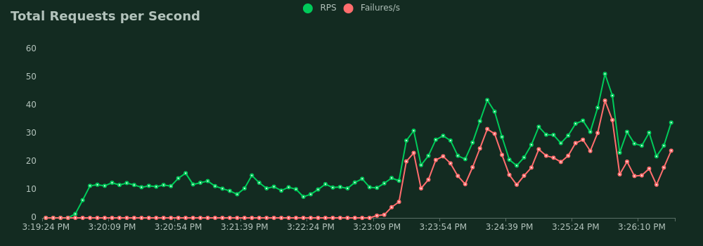
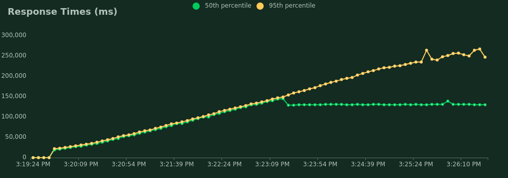
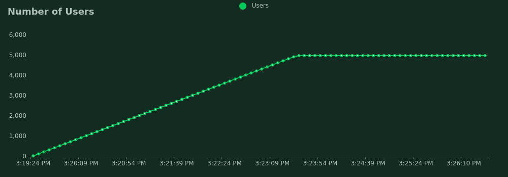
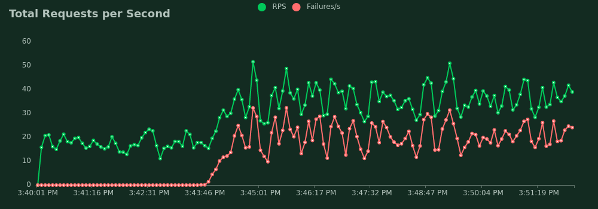
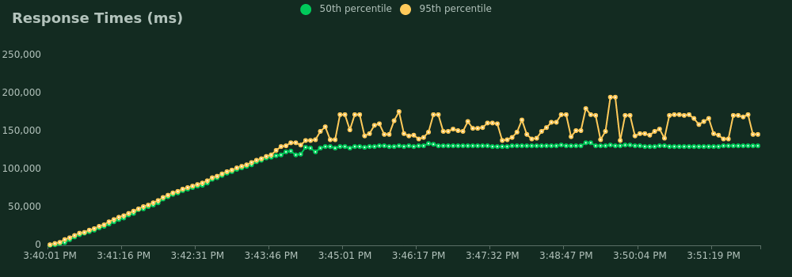
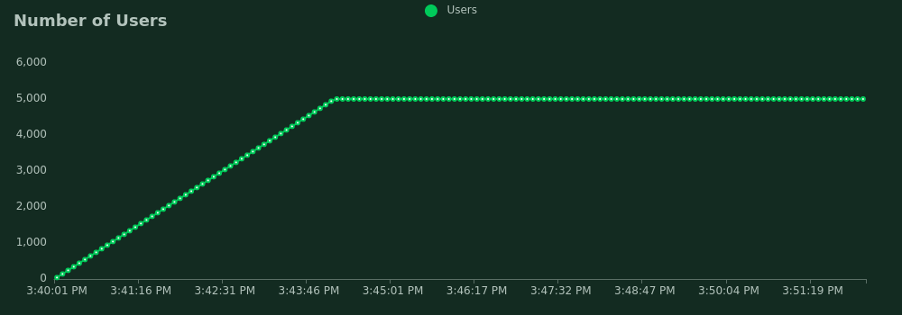
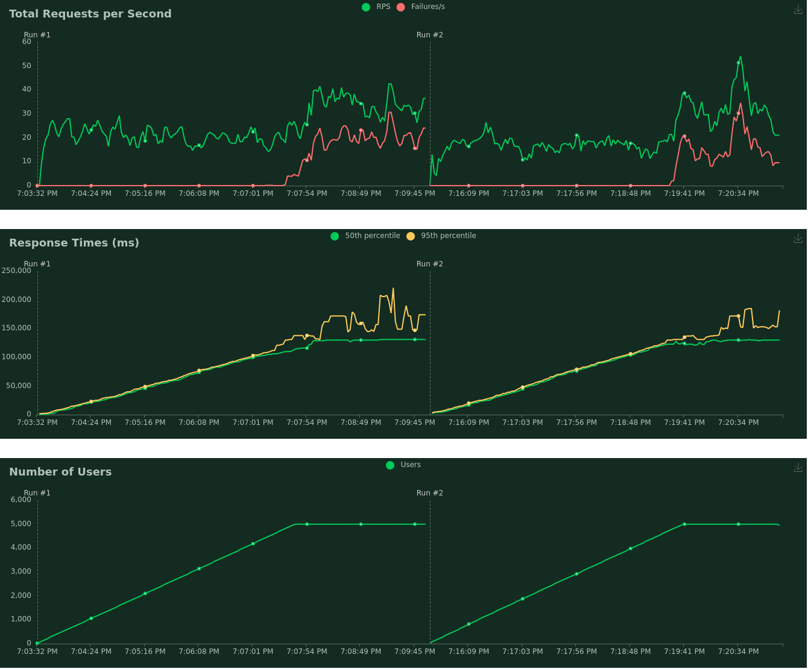

# Stress Report

## System Description

<table width="100%" class="node" summary="attributes of firmware">
<thead>
<tr>
<td class="first">id:</td>
<td class="second">firmware</td>
</tr>
</thead>
<tbody>
<tr><td class="first">description: </td><td class="second">BIOS</td></tr>
<tr><td class="first">version: </td><td class="second">VirtualBox</td></tr>
<tr><td class="first">size: </td><td class="second">128KiB</td></tr>
<tr><td class="first">capacity: </td><td class="second">128KiB</td></tr>
</tbody>
</table>

<table width="100%" class="node" summary="attributes of memory">
<thead>
<tr><td class="first">id:</td><td class="second">
memory
</td></tr>
</thead>
<tbody>
<tr><td class="first">description: </td><td class="second">System memory</td></tr>
<tr><td class="first">size: </td><td class="second">6GiB</td></tr>
</tbody>
</table>

<table width="100%" class="node" summary="attributes of cpu">
<thead>
<tr><td class="first">id:</td><td class="second">
cpu
</td></tr>
</thead>
<tbody>
<tr><td class="first">product: </td><td class="second">AMD Ryzen 5 3500U with Radeon Vega Mobile Gfx</td</tr>
<tr><td class="first">width: </td><td class="second">64 bits</td></tr>
</tbody>
</table>

<table width="100%" class="node" summary="attributes of ide">
<thead><tr><td class="first">id:</td><td class="second">
ide
</td></tr></thead>
<tbody>
<tr><td class="first">description: </td><td class="second">IDE interface</td></tr>
<tr><td class="first">product: </td><td class="second">82371AB/EB/MB PIIX4 IDE</td></tr>
<tr><td class="first">width: </td><td class="second">32 bits</td></tr>
<tr><td class="first">clock: </td><td class="second">33MHz</td></tr>
</tbody>
</table>

## API Test Report

### **# Workers: 1**
### Request and Failure Statistics (5000 Users - 20 Spawn rate)

<table class="stats">
<caption>Table 1. Request Statistics</caption>
<thead>
<tr>
<th class="sortable">Method</th>
<th class="sortable">Name</th>
<th class="sortable"># Requests</th>
<th class="sortable">% Fails</th>
<th class="sortable">Average (ms)</th>
<th class="sortable">Min (ms)</th>
<th class="sortable">Max (ms)</th>
<th class="sortable">Average size (bytes)</th>
<th class="sortable">RPS</th>
<th class="sortable">Failures/s</th>
</tr>
</thead>
<tbody>
<tr>
<td>GET</td>
<td>/</td>
<td>6005</td>
<td>49.34</td>
<td>129303</td>
<td>18739</td>
<td>311801</td>
<td>277</td>
<td>14.0</td>
<td>6.9</td>
</tr>
<tr>
<td>POST</td>
<td>/predict</td>
<td>2041</td>
<td>50.80</td>
<td>131661</td>
<td>21531</td>
<td>298537</td>
<td>35</td>
<td>4.8</td>
<td>2.4</td>
</tr>
<tr class="total">
<td></td>
<td>Aggregated</td>
<td>8046</td>
<td>49.71</td>
<td>129901</td>
<td>18739</td>
<td>311801</td>
<td>216</td>
<td>18.8</td>
<td>9.4</td>
</tr>
</tbody>
</table>

<table class="stats">
<caption>Table 2. Failure Statistics Predict Endpoint</caption>
<thead>
<tr>
<th class="sortable">Method</th>
<th class="sortable">Name</th>
<th class="sortable">Error</th>
<th class="sortable">% Occurrences</th>
</tr>
</thead>
<tbody>
<tr>
<td>POST</td>
<td>/predict</td>
<td>[Errno 104] Connection reset by peer</td>
<td>77.53</td>
</tr>
<tr>
<td>POST</td>
<td>/predict</td>
<td>Remote end closed connection without response</td>
<td>22.47</td>
</tr>
</tbody>
</table>

<table class="stats">
<caption>Table 3. Failure Statistics Index Endpoint</caption>
<thead>
<tr>
<th class="sortable">Method</th>
<th class="sortable">Name</th>
<th class="sortable">Error</th>
<th class="sortable">% Occurrences</th>
</tr>
</thead>
<tbody>
<tr>
<td>GET</td>
<td>/</td>
<td>[Errno 104] Connection reset by peer</td>
<td>72.89</td>
</tr>
<tr>
<td>GET</td>
<td>/</td>
<td>Remote end closed connection without response</td>
<td>27.11</td>
</tr>
</tbody>
</table>

<figure>

<figcaption style="text-align: center">Fig. 1</figcaption>
</figure>

<figure>

<figcaption style="text-align: center">Fig. 2</figcaption>
</figure>

<figure>

<figcaption style="text-align: center">Fig. 3</figcaption>
</figure>

### **# Workers: 4**
### Request and Failure Statistics (5000 Users - 20 Spawn rate)

<table class="stats">
<caption>Table 4. Request Statistics</caption>
<thead>
<tr>
<th class="sortable">Method</th>
<th class="sortable">Name</th>
<th class="sortable"># Requests</th>
<th class="sortable">% Fails</th>
<th class="sortable">Average (ms)</th>
<th class="sortable">Min (ms)</th>
<th class="sortable">Max (ms)</th>
<th class="sortable">Average size (bytes)</th>
<th class="sortable">RPS</th>
<th class="sortable">Failures/s</th>
</tr>
</thead>
<tbody>
<tr>
<td>GET</td>
<td>/</td>
<td>16366</td>
<td>46.33</td>
<td>118600</td>
<td>5</td>
<td>250463</td>
<td>294</td>
<td>22.6</td>
<td>10.5</td>
</tr>
<tr>
<td>POST</td>
<td>/predict</td>
<td>5461</td>
<td>45.06</td>
<td>119861</td>
<td>675</td>
<td>251442</td>
<td>40</td>
<td>7.6</td>
<td>3.4</td>
</tr>
<tr class="total">
<td></td>
<td>Aggregated</td>
<td>21827</td>
<td>46.02</td>
<td>118915</td>
<td>5</td>
<td>251442</td>
<td>230</td>
<td>30.2</td>
<td>13.9</td>
</tr>
</tbody>
</table>

<table class="stats">
<caption>Table 5. Failure Statistics Predict Endpoint</caption>
<thead>
<tr>
<th class="sortable">Method</th>
<th class="sortable">Name</th>
<th class="sortable">Error</th>
<th class="sortable">% Occurrences</th>
</tr>
</thead>
<tbody>
<tr>
<td>POST</td>
<td>/predict</td>
<td>[Errno 104] Connection reset by peer</td>
<td>72.20</td>
</tr>
<tr>
<td>POST</td>
<td>/predict</td>
<td>Remote end closed connection without response</td>
<td>27.80</td>
</tr>
</tbody>
</table>

<table class="stats">
<caption>Table 6. Failure Statistics Index Endpoint</caption>
<thead>
<tr>
<th class="sortable">Method</th>
<th class="sortable">Name</th>
<th class="sortable">Error</th>
<th class="sortable">% Occurrences</th>
</tr>
</thead>
<tbody>
<tr>
<td>GET</td>
<td>/</td>
<td>[Errno 104] Connection reset by peer</td>
<td>71.93</td>
</tr>
<tr>
<td>GET</td>
<td>/</td>
<td>Remote end closed connection without response</td>
<td>28.07</td>
</tr>
</tbody>
</table>

<figure>

<figcaption style="text-align: center">Fig. 4</figcaption>
</figure>

<figure>

<figcaption style="text-align: center">Fig. 5</figcaption>
</figure>

<figure>

<figcaption style="text-align: center">Fig. 6</figcaption>
</figure>

## Stress Report Analysis

**Note:** Firts section shows the API stress test result with a single worker for the model service and second section shows the API stress result with 4 workers for the model service. Several user parameters where tested and it was found that the critical parameters for the API where approximately 5000 users with a spawn rate of 20.

The main differences found on the API performance increasing the number of service workers were: response times and failure requests ocurrences. From tables 2, 3 and tables 5, 6 we can conclude that, if we increase the number of service workers to 4 with our system capabilities, the number of failure ocurrences decrease approximately 1%. On the other hand, if we increase the number of service workers we improve the API response time when the API load is high. 

We found that failure ocurrences showed on Tables 2, 3, 5, 6 occurr because of a low time reponse when the API is under high stress (high load) and also because we exceed the redis queue memory limit.

## Batch Results

<figure>

<figcaption style="text-align: center">Fig. 7</figcaption>
</figure>